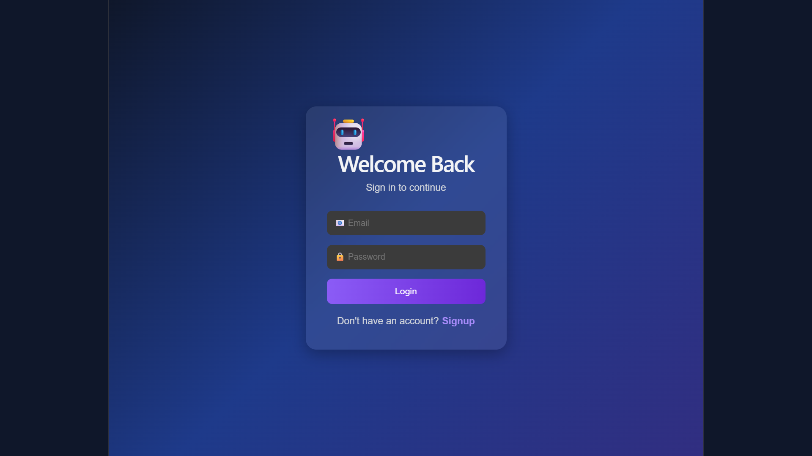
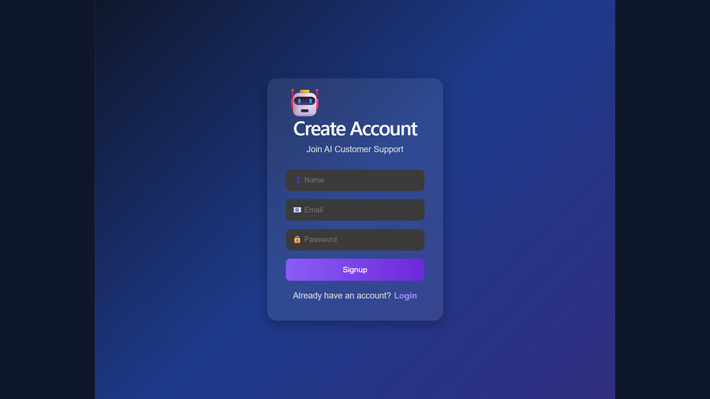
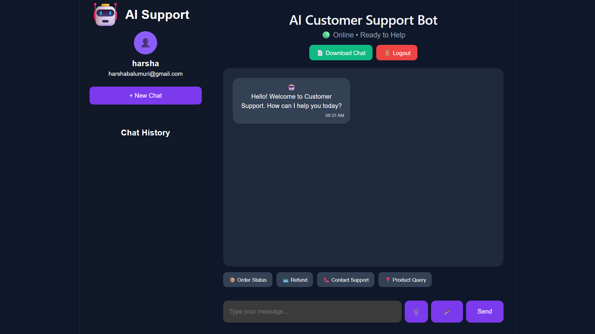
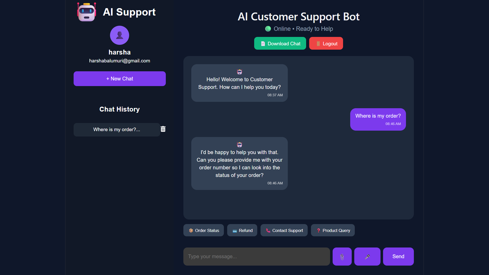
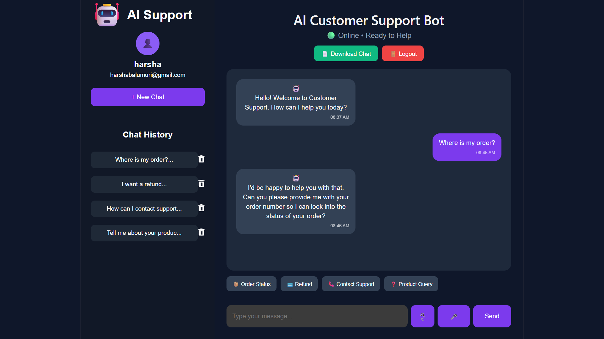

# 🤖 AI Customer Support Bot

An AI-powered customer support chatbot built using the MERN Stack.

## ✨ Features

- User Authentication (Signup/Login)
- AI Chat Support
- Chat History
- Product Queries
- Order Status
- Refund Assistance
- Contact Support
- Responsive UI

## 🛠️ Tech Stack

- React.js
- Node.js
- Express.js
- MongoDB
- JWT Authentication

## 📸 Screenshots

### Login Page



### Signup Page



### Home Page



### Chat Interface



### Chat History



## 🚀 Installation

### Backend

```bash
cd backend
npm install
npm start
```

### Frontend

```bash
cd frontend
npm install
npm run dev
```

## 👨‍💻 Author

**Harsha Balumuri**
